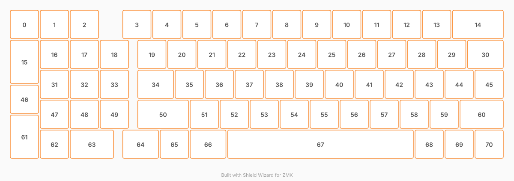

# ZMK Configuration for custom65

*Generated by Shield Wizard for ZMK*

Download compiled firmware from the Actions tab. <https://zmk.dev/docs/user-setup#installing-the-firmware>

Edit your keymap <https://zmk.dev/docs/keymaps>.
User keymap is located at [`config/custom65.keymap`](config/custom65.keymap).

-----
